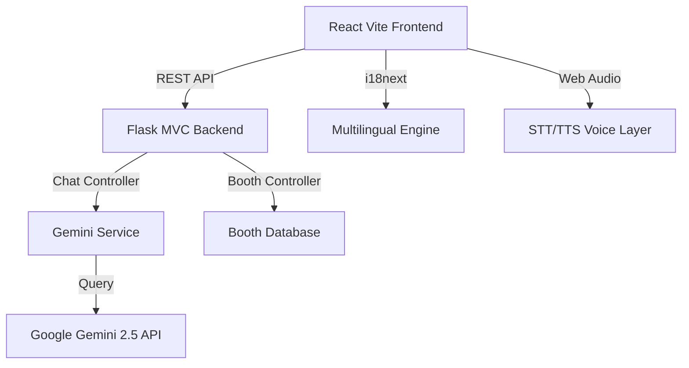

<div align="center">


<br/>

**JanVeda AI** is a cutting-edge civic education platform designed for the 2024 Indian Elections. It uses Gemini AI, Voice-to-Voice workflow, and Multi-lingual support to make democracy accessible, engaging, and transparent for every citizen.

<br/>

[](https://react.dev)
[](https://flask.palletsprojects.com)
[](https://ai.google.dev)
[](https://cloud.google.com/run)
[](https://www.i18next.com)

<br/>

> 🚀 **Modernizing Indian Democracy** — *Voice-Enabled, Multilingual, and AI-Driven*

</div>

---

## ✨ Advanced Features

| Feature | Description |
|---|---|
| 🤖 **Gemini 2.5 AI** | High-performance chatbot with deep knowledge of the Indian Election Process. |
| 🗣️ **Multilingual Voice** | Speak to the system in **English, Hindi, or Gujarati** and receive voice responses. |
| 🌐 **Full i18n Support** | Instant toggle between English, Hindi, and Gujarati across the entire UI. |
| 📍 **Live Booth Finder** | Revamped UI with real-time crowd status, wait times, and facility verification. |
| 🖥️ **EVM Simulator** | Hyper-realistic 8-phase Electronic Voting Machine + VVPAT simulation. |
| 🗓️ **Election Timeline** | Interactive 7-phase election schedule with progress tracking. |

---

## 🧱 Tech Stack

```
Frontend               Backend (MVC)         AI & Voice             Deployment
──────────────────     ─────────────────     ─────────────────      ────────────────────
React 18 + Vite        Flask 3.0             Google Gemini 2.5      Google Cloud Run
Framer Motion          Flask-CORS            Google Cloud STT       Docker
react-i18next          Flask-Limiter         Google Cloud TTS       Gunicorn
Axios                  Modular Routes/Svcs   Firebase Admin         Cloud Build CI/CD
```

---

## 🏗️ System Architecture (Modular MVC)

The project has been refactored from a monolithic script into a professional **Modular MVC Architecture** for scalability and deployment on Cloud Run.



---

## 📁 Project Structure

```
JanVeda AI/
├── frontend/
│   ├── src/
│   │   ├── components/
│   │   │   ├── chatbot/       # Integrated Gemini + Voice Interaction
│   │   │   ├── boothfinder/   # Revamped Premium UI
│   │   │   ├── common/        # Translated Navbar & Footer
│   │   ├── i18n.js            # Translation Dictionary (EN, HI, GU)
│   │   └── pages/             # Route containers
│
├── backend/
│   ├── src/
│   │   ├── controllers/       # Chat, Booth, Quiz logic
│   │   ├── services/          # Gemini API, Firebase integrations
│   │   ├── routes/            # Blueprint registrations
│   │   └── config.py          # Envorinment/API configuration
│   ├── main.py                # Entry point
│   ├── gunicorn_config.py     # Cloud Run optimization
│   └── requirements.txt
│
└── Dockerfile                 # Optimized for Containerized Deploy
```

---

## ⚙️ Local Development

### 1. Environment Configuration
Create a `.env` in both frontend and backend directories.

**Backend (.env):**
```env
GEMINI_API_KEY=your_key_here
FIREBASE_CREDENTIALS_JSON=path_to_service_account.json
PORT=8000
```

**Frontend (.env.local):**
```env
VITE_API_URL=http://localhost:8000
VITE_GOOGLE_CLOUD_API_KEY=your_key_here
```

### 2. Run Backend
```bash
cd backend
pip install -r requirements.txt
python main.py
```

### 3. Run Frontend
```bash
cd frontend
npm install
npm run dev
```

---

## 🚀 Deployment

The platform is optimized for **Google Cloud Run**.

```bash
# Backend Deployment
gcloud run deploy janveda-backend --source ./backend --region asia-south1

# Frontend Deployment
gcloud run deploy janveda-frontend --source ./frontend --region asia-south1
```

---

## 🔒 Security & Performance
- **Gemini 2.5 Flash**: Lightning-fast inference with low latency.
- **Rate Limiting**: Protected by Flask-Limiter to prevent API abuse.
- **CORS Handling**: Secure cross-origin communication.
- **Voice Cache**: Optimized audio playback for smoother interactions.

---

<div align="center">

**Made with ❤️ for Indian Democracy**

*JanVeda AI — Empowering the Indian Voter* 🇮🇳

</div>
